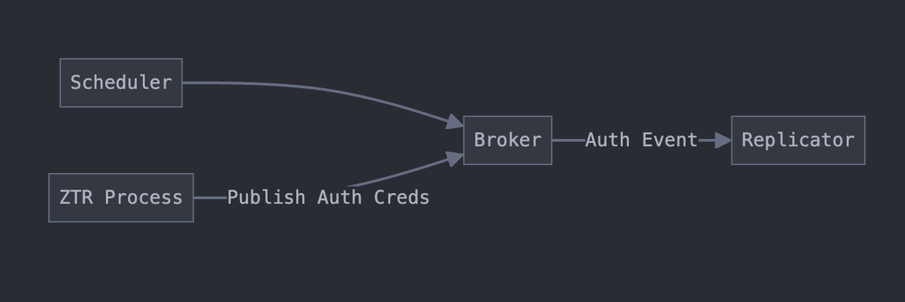

# CNCF Linux Foundation Mentorship '24: Harbor Satellite

This document serves as my final report for the CNCF Linux Foundation Mentorship '24 program. During this mentorship, I had the privilege of working with the Harbor community and contributing to the development of **Harbor Satellite**, a key project aimed at enhancing containerized artifact distribution for edge environments.

Throughout this program, I engaged in innovation and collaboration, pushing the limits of what Harbor Satellite could achieve. My contributions included improving user experience, implementing advanced functionalities, and addressing critical challenges. This report highlights the key milestones and accomplishments during this enriching journey.

## Project Overview

As containers continue to gain traction beyond traditional cloud environments, they are increasingly being deployed in remote and edge computing scenarios. However, these environments often suffer from unreliable internet connectivity, creating challenges in managing and running containerized applications due to difficulties in fetching container images.

The goal of this project is to decentralize container registries, making them more accessible and functional for edge devices, even in connectivity-constrained environments.

- **[Harbor Organization Repository](https://github.com/container-registry/harbor-satellite)**
- **[Personal Repository](https://github.com/Mehul-Kumar-27/harbor-satellite)**

****

## What is Harbor Satellite?

To understand Harbor Satellite, it's essential first to understand **Harbor**. Harbor is a CNCF open-source container registry designed to manage container images and artifacts securely. It includes features like policies, role-based access control (RBAC), vulnerability scanning, and image signing. However, Harbor has limitations in edge locations where it does not perform as reliably due to connectivity, scalability and hardware challenges.

**Harbor Satellite** addresses these gaps by providing a containerized artifact distribution and management solution specifically tailored for edge environments. It ensures consistent, available, and integrity-verified artifacts, even at scale.

### The Growing Need for Edge Computing Solutions

Containers are now running everywhere, from the cloud to edge devices. Effective software distribution and management are essential in these scenarios. Examples include:
- The U.S. Air Force deploying Kubernetes and Istio on F-16 fighter jets.
- Domino's Pizza running Kubernetes clusters in 10,000+ branches globally.
- SNCF (French National Railways) operating Kubernetes clusters on trains.
- Telecommunications providers managing Kubernetes in thousands of cell towers, resulting in over 100,000 registries.

### Challenges Solved by Harbor Satellite

Harbor Satellite addresses several key issues:
1. **Software Distribution to the Edge**: Ensures seamless delivery of software to remote and edge locations.
2. **Management of Software Delivery and Rollout**: Orchestrates software updates and distribution remotely.
3. **Scalability**: Supports software distribution across thousands of sites efficiently.
4. **Resilience in Poor Connectivity**: Maintains predictable behavior and performance in environments with unreliable internet.
5. **Controlled Image Replication**: Provides fine-grained control over image replication and presence across devices.
6. **Optimized Resource Usage**: Minimizes bandwidth and resource utilization to suit edge environments.

***

<em>System Overview</em>

***

### Brief Overview of Components

Harbor Satellite consists of three main components: **Ground Control** (located in the cloud or a location with reliable connectivity) and **Satellite** (deployed at the edge location). Additionally, there is a ***Central Repository*** that hosts container images and OCI artifacts, which are replicated by Harbor Satellite.

- #### Ground Control
  Ground Control is responsible for monitoring Satellites deployed at edge locations. It authenticates Satellites and provides the capability to specify which images or artifacts should be replicated. Ground Control manages permissions for Satellites, creates credentials for them, and securely provides these credentials.

  It is a stateful component, utilizing a PostgreSQL database to store data about the various Satellites.

- #### Satellite
  The Satellite component operates at remote edge locations. It replicates images from the central repository and includes an **OCI Zot repository**, which runs alongside it to store images locally at the edge. Alternatively, users can provide their own repository if they prefer not to use the built-in Zot repository.

- #### Central Repository
  The central repository is present with the Ground Control over the network and the Satellite replicates images from this. The credentials for this repository is provided to the Satellite by the Ground Control.

### Workflow of the System

#### Step 1: Create State Artifact for Each Group
1. A patched version of Harbor uses a replication rule where:
   - Users specify the projects to replicate.
   - The `group name` is set as the namespace.

2. When the rule executes:
   - It creates a JSON state artifact containing image paths to track.
   - This artifact is pushed to the `satellite` project in Harbor as an OCI artifact under the `group name`.

3. Harbor sends a JSON request to the `ground control` URL (registry URL), which:
   - Creates the satellite project and the group repository.
   - Adds the state artifact to the repository.

#### Step 2: Register Satellite Under a Group
1. The replication rule updates the `ground control` database with group details (e.g., group name and projects).
2. Users register a satellite to the group via a POST request. On success, the system provides a `token` for satellite authentication.
3. The satellite uses this token to authenticate with `ground control` and receives authentication credentials in return.

#### Step 3: Start Replication
1. The satellite regularly replicates images/artifacts based on the state artifact after the initial replication.

### My Contributions 🚀

Here are my contributions to the Harbor Satellite project, ranging from feature development and bug fixes to CI/CD pipelines, testing, and documentation.

#### CI/CD Pipeline for GitHub Releases
- Built a robust CI process using [Dagger](https://dagger.io/) to release binaries and test the Harbor Satellite code. Dagger simplifies the process with isolated environments for testing and streamlined builds using dev containers.

  <a href="https://github.com/container-registry/harbor-satellite/pull/37">Related Pull Request</a>

#### Codebase Refactoring and Test Fixes
- Refactored the codebase to improve modularity and decouple components. Fixed a failing test case and implemented a route-handling mechanism to create router groups, add child routes, and apply middleware to specific groups, ensuring better scope separation.

  <a href="https://github.com/container-registry/harbor-satellite/pull/44">Related Pull Request</a>

#### Fetching and Replicating State Artifacts
- Added functionality to fetch and replicate state artifacts from the Harbor registry using cron jobs. These jobs run periodically to detect new, updated, or removed images. It fetches new and updated images from the source registry and deletes outdated images from the local registry.
- Users can specify the cron job schedule through the satellite config file.

  <a href="https://github.com/container-registry/harbor-satellite/pull/55">Related Pull Request</a>

#### Changing Container Runtime Configuration, Zero Touch Registration, Update Configs of Cron Jobs
- **Config for Container Runtime Configuration**

    - **Use Case -:**
    Harbor Satellite runs in a remote, isolated environment, making it difficult for users at distant locations to know the local repository address. Additionally, users may attempt to pull images not present in the local registry.
    To address these issues, Harbor Satellite allows users to generate a config file for two popular container runtimes, `Crio` and `Containerd`. This config file automatically points to the local registry when pulling images.
    For example, if the Harbor Satellite local registry is running on port `8585`:
    - Without the config, the pull command would be `crictl pull localhost:8585/your-image:tag`.
    - After applying the generated config, it becomes `crictl pull satellite.zot/your-image:tag`.
    - If the image is not found locally, the satellite registry mirrors the Docker registry and will fetch the image from Docker Hub.

- **Zero Touch Registration**

  - Implemented the functionality for satellite to authenticate itself with the ground control and get the state file url and the auth credentials for the robot account, so that it can pull the images from the harbor registry.

- **Update Configs of Cron Jobs**

  - The `Zero Touch Registration` provides the auth credentials to the cron jobs which replicate the images, this happens during runtime and its uncertain whether the authentication happens immediately due to connectivity issues. To make sure that every process updates its config during I implemented a simple but effective event driven broker system to implement the inter process communication.
  - Here is how the architecture looks like

    - A `Scheduler` is attached to the satellite, capable of scheduling cron job stops.
    - A `Broker` is linked to the scheduler, acting as the event repository.
    - `Processes` can subscribe or unsubscribe to events by creating a channel in the broker.
    - When a `Process` generates an event, it publishes it to all processes, who have subscribed to it via the broker’s channel.

  <a href="https://github.com/container-registry/harbor-satellite/pull/64">Related Pull Request</a>

#### Workflow to Build, Sign, and Publish Images
- In this Pull Request, I added functionality to build, sign, and publish Harbor Satellite images. I used Dagger for the CI/CD process and `COSIGN` for signing. The images are built for multiple architectures, including `linux/arm64`, `linux/ppc64le`, `linux/s390x`, `linux/386`, `linux/riscv64`, and `linux/amd64`.

  <a href="https://github.com/container-registry/harbor-satellite/pull/67">Related Pull Request</a>

#### Bug Fix in Robot Account Creation on Ground Control
- Fixed a bug in Ground Control where the robot account created on Harbor for the satellite initially lacked sufficient permissions to pull images.

  <a href="https://github.com/container-registry/harbor-satellite/pull/69">Related Pull Request</a>

#### Quickstart Documentation for Harbor Satellite
- Added Quickstart documentation to guide users on setting up the project with Ground Control and Harbor.

  <a href="https://github.com/container-registry/harbor-satellite/pull/71">Related Pull Request</a>

### Future Work
Here are some features I plan to add to Harbor Satellite:

- **Rate Limiter for Replication**: Implement a rate limiter to allow users to cap the maximum data transferred between Harbor and the satellite.
- **Improved Authentication**: Enhance the authentication process between Ground Control and Harbor Satellite for better security and flexibility.
- **Expanded Test Coverage**: Improve test cases to ensure comprehensive coverage of the codebase.

### Acknowledgment
I would like to thank the Harbor Community for their support throughout the mentorship process. Special thanks to my mentors, [Vadim Baurer](https://github.com/Vad1mo) and [Prasanth B](https://github.com/bupd), for their invaluable guidance—this achievement would not have been possible without them. ❤️

#### References
- [Harbor Satellite](https://github.com/container-registry/harbor-satellite)
- [Crio](https://github.com/cri-o/cri-o)
- [Containerd](https://github.com/containerd/containerd)
- [Harbor Docs](https://goharbor.io/docs/2.4.0/)
- [Dagger](https://dagger.io)
- [Zot](https://zotregistry.dev/v2.1.0/)
